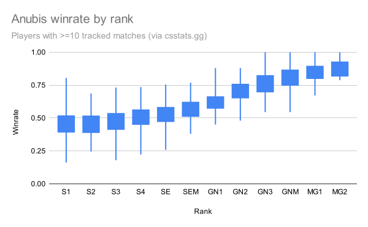
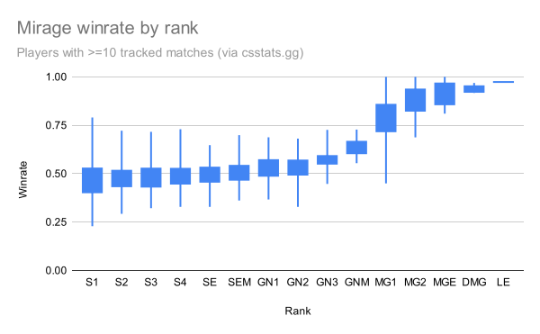

# csstatsgg-stats

Scrapes and analyzes data from csstats.gg. Mostly interested in figuring out how broken the Competitive ranks are.

## Winrate by rank

Players with >=10 tracked matches

### Anubis



```txt
  S1: mean=0.46, stdev=0.109, n=36
  S2: mean=0.46, stdev=0.091, n=111
  S3: mean=0.48, stdev=0.089, n=116
  S4: mean=0.50, stdev=0.080, n=161
  SE: mean=0.52, stdev=0.086, n=174
 SEM: mean=0.57, stdev=0.077, n=133
 GN1: mean=0.63, stdev=0.072, n=68
 GN2: mean=0.69, stdev=0.085, n=26
 GN3: mean=0.76, stdev=0.091, n=242
 GNM: mean=0.81, stdev=0.086, n=130
 MG1: mean=0.84, stdev=0.081, n=42
 MG2: mean=0.87, stdev=0.067, n=24
```

### Mirage




```txt
  S1: mean=0.47, stdev=0.108, n=132
  S2: mean=0.48, stdev=0.073, n=180
  S3: mean=0.48, stdev=0.074, n=124
  S4: mean=0.49, stdev=0.067, n=121
  SE: mean=0.49, stdev=0.058, n=126
 SEM: mean=0.51, stdev=0.053, n=117
 GN1: mean=0.53, stdev=0.058, n=99
 GN2: mean=0.53, stdev=0.069, n=53
 GN3: mean=0.57, stdev=0.061, n=23
 GNM: mean=0.64, stdev=0.056, n=8
 MG1: mean=0.79, stdev=0.102, n=354
 MG2: mean=0.88, stdev=0.075, n=103
 MGE: mean=0.92, stdev=0.066, n=16
 DMG: mean=0.94, stdev=0.020, n=4
  LE: mean=0.97, stdev=0.000, n=1
```

## How to run

```sh
poetry install
poetry run python3 csstatsgg_stats
poetry run python3 csstatsgg_stats/analyze.py 
```
